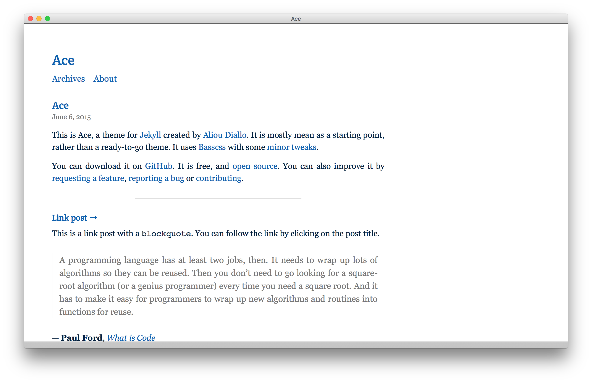

## Ace

A [Jekyll][jekyll] theme (3.2+), using the [official Jekyll theme implementation][theme-docs].



## Installation

1. Install Jekyll: `gem install jekyll`
2. Install Ace: `gem install ace-theme`
3. Add the theme to your configuration:
```yaml
theme: ace-theme
```
4. Enable pagination in your configuration:
```yaml
gems: [jekyll-paginate]
paginate: 5
paginate_path: '/:num'
```
5. Import the theme in your main css file:
```scss
// At the bottom of your file:
@import "ace";
```
6. Finally, run the server and see your changes:
```sh
jekyll serve
```
You should have a server up and running locally at <http://localhost:4000>.

## Customization

Next you'll want to change a few things. Most of them can be changed directly in `_config.yml`.
That's where you will put the name, the URL and the description of your blog and other settings.

[jekyll]: http://jekyllrb.com/
[fork]: https://github.com/aliou/ace/fork
[theme-docs]: https://jekyllrb.com/docs/themes/
